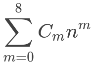
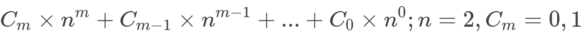
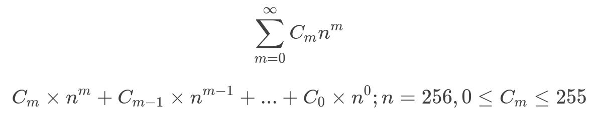
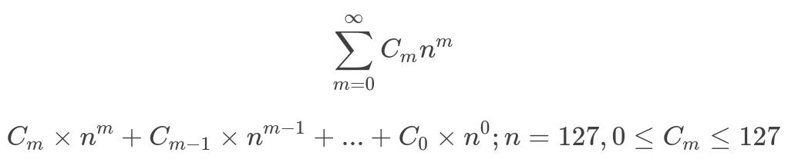

# BigBit
An alternate and improved data type of decimal and floating point

Table Of Contents
* Abstract
* Introduction

# Abstract
Floating point arithmetic is a key component for the computer applications doing mathematical calculations specially the applications related to finance or science experiments. It requires large dynamic range and high level of accuracy. Here I'm proposing a new floating number format **BigBit** to store large range of decimal numbers in less space without losing any precision.

# Introduction

There are different representations used to store a number in computer memory as per either their length (number of digits) or size. Eg int32, int64, binary32 (IEEE 754 Single-precision floating-point format ), binary64 ( IEEE 754 Double-precision floating-point format ) etc. But these representations are limited to represent a number to certain size and precision. Eg int32 can represent an integer number up to 2,147,483.647 with 4 bytes fixed memory to store it. Whereas binary32 can represent a decimal number up to  3.402823 × 10^38^ (approx) with 4 bytes in memory. However you lose the precision after certain limit in decimal representation.

As there are different number formats can be used as per their possible values, a developer needs to have low level detail to carefully select a number type for a variable to store it. Otherwise unpredictable incorrect result may occur.

## Number formats

### Fixed point number
A fixed point number has a specific number of bits (or digits) reserved for the fractional part (the part to the right of the decimal point) and sometimes  a specific number of bits reserved for the integer part (the part to the left of the decimal point). No matter how large or small a number is, it will always use the same number of bits for each portion. For example, if a fixed point format was in decimal IIIII.FFFFF then the largest number can be represented would be 99999.99999 and the smallest would be 00000.00001 (considering positive numbers only).

Every bit of code that processes such numbers has to have built-in knowledge of where the decimal point is and a mechanism for rounding the numbers when they've more digits than expected. Eg a number 1.2999 can be rounded to 1.30 or 1.29 for I.FF representation.

### Floating point number
A floating point number does not reserve a specific number of bits for the integer part or the fractional part. With the understanding with *IEEE 754 floating point format* we can further say that it reserves a certain number of bits for the number (called the mantissa or significand) and a certain number of bits to say where within that number the decimal place sits (called the exponent).

## IEEE 754 standard

To understand BigBit format better, we need to understand its need  by comparing it with the widely used number format standard [IEEE 754](https://en.wikipedia.org/wiki/IEEE_754).

IEEE Standard for Floating-Point Arithmetic (IEEE 754) is a technical standard for floating-point computation established in 1985. Many hardware, software, and other standards are using IEEE 754 standard. This standard specifies 2 formats of floating point numbers;
* Single-precision floating-point format
* Double-precision floating-point format

More formats were added later.

### [Single-precision floating-point format](https://en.wikipedia.org/wiki/Single-precision_floating-point_format)
This format is also known as float or binary32. This format occupies 32 bits ( or 8 bytes) in computer memory. It can be  represented as follow;


* Sign bit: 1 bit
* Exponent : 8 bits 
* Mantissa (fraction) : 23 bits 

This format can accurately represents number between 2<sup>-24</sup> and  2<sup>+24</sup> and all the numbers represented by 2<sup>n</sup>, where the value of n is in between -126 and +127.

However a number out of the given range above can also be stored on the cost of losing the precision. Eg. If we store a number 2<sup>24</sup> + 1, it actually stores as 2<sup>24</sup>.

### [Double-precision floating-point format](https://en.wikipedia.org/wiki/Double-precision_floating-point_format)
This format is also known as double or binary64. This format is same as single precision format but it occupies 64 bits ( or 16 bytes) in computer memory. 

* Sign bit: 1 bit
* Exponent : 11 bits 
* Mantissa (fraction) : 53 bits 

Hence the higher range can be represented accurately i.e. all the numbers between 2<sup>-53</sup> and  2<sup>+53</sup> and all the numbers represented by 2<sup>n</sup>, where the value of n is in between -1022 and +1023.

### Decimal floating-point format
decimal32, decimal64, and decimal128 formats were added to IEEE 754 standard in year 2008. This format occupies 32, 64, and 128 bits in memory respectively. These formats were added to remove the rounding errors so that the numbers can be used by financial and tax computations. So, for instance, if we subtract 0.2 from 0.3, it is `0.3 - 0.2 = 0.09999999999999998` in case of precision floating point format and it is `0.3 - 0.2 = 0.01` in decimal floating point format.

Significand and exponent in this format can be encoded in multiple ways as there is not any specific way defined in the standard itself, eg. [DPD (Densely Packed Decimal)](https://en.wikipedia.org/wiki/Densely_packed_decimal), and [BID (Binary Integer Decimal)](https://en.wikipedia.org/wiki/Binary_integer_decimal).

# BigBit format

BigBit (aka ByteBit) format is pretty much similar to any ordinary binary number representation. However the maximum value of coefficient is 255 instead of 1 and base is 256 instead of 2.

### Binary format
Binary number can be represented by 0 or 1. A decimal number in binary format can be represented as

<div align="center">
  
  
</div>

We can use above expression to represent 23 in binary format as follows;

1 x 2<sup>4</sup> + 0 x 2<sup>3</sup> + 1 x 2<sup>2</sup> + 1 x 2<sup>1</sup> + 1 x 2<sup>0</sup>

And the series of coefficient can be represented as `10111` in binary, where each digit represents the value of 1 bit. Maximum value that can be represent is `11111` i.e. 31. But as it takes at least 1 byte (8 bits) in memory to represent this number, the maximum number a byte can represent is 255.

### BigBit format

BigBit format consider 1 byte as bit and use the same equation to represent a decimal number. Since a byte can represent all the numbers between 0 and 255, we can re-write the equation as follows;



We can use above expression to represent 4295033089 in ByteBit format as follows;

1 x 256<sup>4</sup> + 0 x 256<sup>3</sup> + 1 x 256<sup>2</sup> + 1 x 256<sup>1</sup> + 1 x 256<sup>0</sup>

And the series of coefficient can be represented as `[1,0,1,1,1]`, where each digit represents the value of 1 byte. Maximum value that can be represent with 5 bytes is `[255,255,255,255,255]` i.e. 1.099511628×10¹². 

Though it looks very similar to representation of binary number, the actual representation is reversed with an extra byte for head byte `[5,1,1,1,0,1]`. This representation makes it easy to implement and understand.

## Memory Representation

BigBit standard specifies 3 formats;
* Head Byte (HB) format
* Extended Head Byte (EHB) format
* Linked Bytes (LB) format

### Head Byte format

This is how a number can be represented in memory using Head Byte format;


Starting byte in the above diagram is the head byte. It tells three things;
1. If a number is positive or negative (First bit)
2. If there is any byte present to tell the value of exponent. (Second bit)
3. How many bytes are present to represent the sequence of coefficients and exponent. ( Next 6 bits)

As there are 6 bits reserved to tell the count of coefficient and exponent bytes, there can be maximum 2^6^ - 1 = 63 bytes to represent the sequence. So the largest number it can represent is  `13407807929942597099574024998205846127479365820592393377723561443721764030073546976801874298166903427690031858186486050853753882811946569946433649006084095` or `1.34078079e+154`.

If the second bit of the head byte is 1 then the next byte represent the value of exponent, where the first bit of the exponent byte tells the sign.


#### Representable Numbers
As we seen above, HB format can represent the numbers between `-1.34078079e+154` and `+1.34078079e+154` but the value of exponent can be between `-127` and `+127` only. Which means the largest decimal number this format can represent is `1.34078079e+127`.

In addition other types which can be represented by this format are;

| Number Type | Minimum Bytes | Maximum Bytes | Value |
| ------------- | ------------- | --------------- | --------------- |
| Zero | 1 | 1 |  0 000 0000 |
| NaN | 1 | 1 |  1 000 0000 |
| +&infin; | 1 | 1 | 0 100 0000 |
| -&infin; | 1 | 1 | 1 100 0000 |


The value of exponent byte can be in between -127 and 127. It means having the exponent byte, Head Byte format can represent the number up to`±1.34078079e+281` without losing any precision.

### Extended Head Bye format

Extended Head Byte (EHB) format is pretty much similar to Head Byte format. But the count of coefficient bytes and the value of the exponent can be extended. It means this format can represent infinite numbers without precision loss.


In above diagram;

**1st Byte** is the head byte. It gives the following information
1. If a number is positive or negative (1st bit)
2. If there is any byte present to tell the value of exponent. (2nd bit)
3. If the extended bytes to represent the extended count of coefficient and exponent bytes are present. (3rd bit)
5. Remainder of 32 base number which tell how many coefficient and exponent bytes are present ( Next 5 bits)

**2nd Byte** is extended count byte. It presents only if the 3rd bit of head byte is 1. The first bit of the extended count is the link bit and set to 1 if there is another extended byte is present. Value of extended count byte represents the quotient of base 32 number. So the total count of exponent and coefficient bytes can be calculated as `32x3 + 1 = 97`

**3rd Byte** is exponent byte. It presents only if the 2nd bit of head byte is 1. The first bit of the exponent byte is the link bit and set to 1 if there is extended exponent byte is present. The second bit of exponent byte is the sign bit.  Rest of the bits represent the remainder of base 64 number. Th value of extended exponent byte represent the quotient and it can be between 0 - 127. The first bit of all extended exponent bytes is the link bit and rest 7 bits contains value. 

**Next 96 bytes** are coefficient bytes.

#### Representable Numbers
Extended Head Byte can represent infinite range of numbers without precision loss. In addition, other types which can be represented by this number are;

| Number Type | Minimum Bytes | Maximum Bytes | Value |
| ------------- | ------------- | --------------- | --------------- |
| Zero | 1 | 1 |  0 000 0000 |
| NaN | 1 | 1 |  1 000 0000 |
| +&infin; | 1 | 1 | 0 100 0000 |
| -&infin; | 1 | 1 | 1 100 0000 |


### Linked Bytes format
Unlike above two formats, Linked Bytes format doesn't have any head byte. Instead this format is used to represent positive integers only. First bit of every byte indicates that the next byte is coefficient byte.


We can use the same expression to denote Linked bytes sequence with base 128.



The only advantage of Linked Bytes format over Head Byte format is saving 1 extra byte for the numbers up to 2.814749767×10¹⁴ . And using same number of bytes to represent a number from 2.814749767×10¹⁴ + 1 to 7.205759404×10¹⁶.

## Arithmetic

BigBit standard doesn't only save computer memory, it allows direct arithmetic on bytes instead of converting them to decimal number first to speed up the processing. For instance, head byte can tell the count of bytes used in memory, which helps to skip to the next data  without decoding current data. In addition, here is explanation of how basic mathematics operations can be performed on bytes.

In case of Linked Bytes format, all the bytes excluding last byte need to be subtracted by 128 or bitwise AND (&) by 127 before any mathematical operation as the MSB is 1.

### Addition
Number `25487` and `22659874523` can be represented as follow. ( coefficient bytes only) 
```
X = 25487  = [ 143, 99]
Y = 22659874523 = [ 219, 62, 162, 70, 5 ]
Z = X + Y
```

We can directly add the series in such a way that the value of any coefficient must not be more than 255. For this we can think each coefficient as up-counter, range from 0 to 255. As soon as the value of a coefficient reaches to 256, it resets to 0 and the next coefficient is increased by 1. 

```
X[0] + Y[0] = 143 + 219 = 362 = 106 + 256 
=> [ 106, 1 ]

X[1] + Y[1] = 99 + 62 = 161
=> [ 106, 162 ]

X[2] + Y[2] = 0 + 162 = 162
=> [ 106, 162, 162 ]

X[3] + Y[3] = 0 + 70 = 70
=> [ 106, 162, 162, 70 ]

X[4] + Y[4] = 0 + 5 = 5
=> [ 106, 162, 162, 70, 5 ]
```

Please note that 
* if any of the number is having the exponent then the value of exponent for both numbers need to be equal before any operation.
* the same procedure will be used to operate linked bytes for addition but we'll use base 128 number instead. 

### Subtraction
To subtract 25487 from 22659874523, we can represent the series of coefficient bytes as follows; 

```
X = 25487  	= [ 143, 99]
Y = 22659874523 = [ 219, 62, 162, 70, 5 ]
Z = X - Y
Z = -(Y - X) //Since X is biiger than Y
```
First we need to know which number is bigger. If we are subtracting big number from smaller then change the sign bit of result number. Now subtract each coefficient such that if the result is negative then borrow 256 from the next coefficient and subtract 1 from next coefficient.

```
Y[0] - X[0] = 219 -  143  = 76
=> [ 76 ]

Y[1] - X[1] = 62 -  99  = -37 = 256 - 37
=> [ 76, 219, -1 ]

Y[2] - X[2] = 162 -  0  = 162
=> [ 76, 219, 161 ]

Y[3] - X[3] = 70 -  0  = 70
=> [ 76, 219, 161, 70 ]

Y[4] - X[4] = 5 -  0  = 5
=> [ 76, 219, 161, 70, 5 ]

```
Please note that 
* if any of the number is having the exponent then the value of exponent for both numbers need to be equal before any operation.
* the same procedure will be used to operate linked bytes for subtraction but use base 128 number instead.

### Other operations
For Head Byte and Extended Head Byte format;
* We can perform the multiplication and division in the same way we multiply or divide polynomial equations. 
* To make a number absolute, we just need to change the sign bit. 
* To compare two numbers (having same exponent), we need to compare the count of coefficient bytes. If they are same we can compare the value of last coefficient byte.
* To make a number odd/even or to determine if a number is odd/even, We can change/ check the last bit of 1st coefficient byte.
* To change the position of decimal point, the value of exponent byte can be changed.

For Linked Bytes format
* We can perform the multiplication and division in the same way we multiply or divide polynomial equations. 
* To make a number odd/even or to determine if a number is odd/even, We can change/ check the last bit of 1st coefficient byte.

