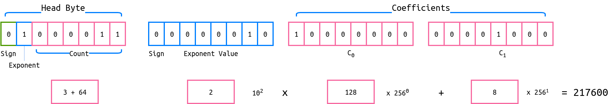
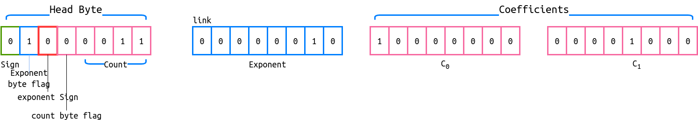
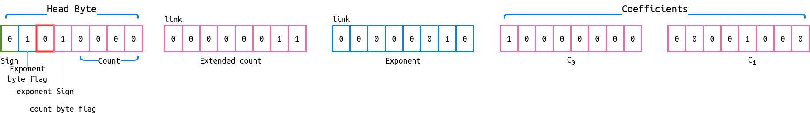

# BigBit
An alternate and improved data type for decimal floating-point numbers

Table Of Contents
* [Abstract](#abstract)
* [Introduction](#introduction)
  * [Number formats](#number-formats)
  * [IEEE 754 standard](#ieee-754-standard)
* [BigBit standard](#bigbit-standard)
  * [Head Byte format](#head-byte-format)
  * [Extended Head Byte format](#extended-head-byte-format)
  * [Linked Bytes format](#linked-bytes-format)
* [Encoding](#encoding)
* [Security](#security)
* [Term](#term)

# Abstract
Floating-point arithmetic is a key component of computer programs doing mathematical calculations, especially of the programs related to financial infrastructure or scientific analysis. For those purposes, it requires a large dynamic range of representable numbers and a high level of accuracy. Here I'm proposing **BigBit** — a new floating-point number format to store a large range of decimal numbers while using less memory or disk space and without losing any precision.

# Introduction
There are different representations used to store a number in computer memory as per either their length (number of digits) or their size as a number. The common ones are `int32` (32 binary digits, signed integer), `int64` (same, but with 64 binary digits), `binary32` (IEEE 754 floating-point format which spans 32 bits), `binary64` (same, but 64 bits wide), along with several others. But these representations are limited to represent a number of certain size or with limited precision. For example, `int32` can represent integers up to 2 147 483 647 with 4 bytes of fixed memory to store it; `binary32` can represent a rational floating-point number up to 3.402823 × 10³⁸ (approximately; the exact number is binary since the format deals with binary rational numbers) with the same 4 bytes in memory. With the latter, however, you lose the precision after a certain point as the numbers increase.

As there are different number formats for various situations, a developer needs to have low level details to carefully select a number type for a variable or, much worse, a disk/network serialization format to store it. Should the developer make a mistake in that process, the consequences will be largely unpredictable.

## Number formats

### Fixed-point formats
A fixed-point format has a specific number of bits (binary digits) reserved for the fractional part (the part to the right of the fractional point) and sometimes a specific number of bits reserved for the integer part (the part to the left of the fractional point). No matter how large or small a number is, it will always use the same number of bits for each of those parts. For example, a decimal fixed-point format which looks like `IIIII.FFFFF` will only be able to represent numbers from 00000.00001 to 99999.99999 (as well as their negative counterparts if a sign is added).

Every bit of code that processes such numbers needs built-in knowledge of where the fractional point is and a mechanism for rounding the numbers when they obtain more digits than the format can represent: a number 1.2999 can be rounded to 1.30 or 1.29 for the fixed-point format `I.FF`.

### Floating-point formats
A floating-point format does not reserve a specific number of bits for the integer part or the fractional part. The *IEEE 754 floating-point family of formats* reserves a certain number of bits for the number (called the mantissa or significand) and a certain number of bits to say where within that number the fractional point sits (called the exponent).

## IEEE 754 standard
To understand the BigBit format better, it's crucial to understand the [IEEE 754](https://en.wikipedia.org/wiki/IEEE_754 "IEEE 754 on Wikipedia") and its implications.

The IEEE Standard for Floating-Point Arithmetic (IEEE 754) is a technical standard for floating-point computations established in 1985. Various hardware and software implements IEEE 754 standard, even more software uses it. The standard specifies an entire family of floating-point formats, but the most widely used ones are the single-precision binary floating-point format and its double-precision counterpart.

### [Single-precision floating-point format](https://en.wikipedia.org/wiki/Single-precision_floating-point_format)
Named `binary32` in the original standard, this format is also known as `float` or `f32`. This format occupies 32 bits (or 4 bytes) in computer memory. It can be laid out as follows:


* Sign bit: 1 bit
* Exponent: 8 bits 
* Mantissa (significand): 23 bits 

This format can accurately represent numbers between 2<sup>-24</sup> and 2<sup>+24</sup> and all values of 2<sup>n</sup>, where the value of n is between -126 and +127.

However a number out of the given range above can also be stored, with the implication of the stored value being slightly or severely imprecise. For example, all attempts to store 2<sup>24</sup> + 1 result in 2<sup>24</sup> being stored instead.

### [Double-precision floating-point format](https://en.wikipedia.org/wiki/Double-precision_floating-point_format)
This one is named `binary64` and is commonly referred to as `double` or `f64`. This format is same as the single-precision format, but it occupies 64 bits (or 8 bytes) in computer memory. 

* Sign bit: 1 bit
* Exponent: 11 bits 
* Mantissa (significand): 53 bits 

The range of precisely stored numbers in this case is inherently bigger — it occupies all the numbers between 2<sup>-53</sup> and 2<sup>+53</sup> and all values of 2<sup>n</sup>, where the value of n is between -1022 and +1023.

### Decimal floating-point formats
The `decimal32`, `decimal64`, and `decimal128` formats were added to IEEE 754 standard in 2008 (hence the name of their standard, IEEE 754-2008). These formats occupy 32, 64, and 128 bits in memory respectively. They were added to mitigate the rounding errors for decimal numbers so that the numbers can be used by financial and tax computations. The famous example is the result of subtracton of 0.2 from 0.3, which is 0.09999999999999998 when stored in the single- and double-precision binary floating-point formats and is 0.01 when the decimal formats are used.

The significand and exponent in this format can be encoded in multiple ways, thus there is not a specific way defined in the standard itself. The commonly used ones are [DPD (Densely Packed Decimal)](https://en.wikipedia.org/wiki/Densely_packed_decimal "Densely packed decimal on Wikipedia") and [BID (Binary Integer Decimal)](https://en.wikipedia.org/wiki/Binary_integer_decimal "Binary integer decimal on Wikipedia").

# BigBit standard
The BigBit format is somewhat similar to the binary number formats used today. However, the base used is 256 instead of 2, meaning that each BigBit digit can represent all numbers from 0 to 255, in contrast to the narrow range of binary digits, which represent either 0 or 1.

### Binary number storage
The two possible states for a binary digit are 0 and 1. A binary series of digits can be converted into a mathematically real number as follows:

<div align="center">
  
  
</div>

We can use the above formula to represent 23 in binary as follows:

1 x 2<sup>4</sup> + 0 x 2<sup>3</sup> + 1 x 2<sup>2</sup> + 1 x 2<sup>1</sup> + 1 x 2<sup>0</sup>

The series of coefficients can be represented as `10111` in binary, where each digit represents the value a bit. Maximum value that can be represented with this amount of digits is `11111` i.e. 31. However, since it takes at least 1 byte (8 bits) in memory to represent a number in modern computers, the maximum number a binary number can represent is at least 255.

### BigBit number storage
The BigBit format uses bytes in place of bits in the above formula. Since a byte can represent all the numbers between 0 and 255, we can re-write the equation as follows:


We can use the above formula to represent the number 4295033089 in BigBit as follows:

1 x 256⁴ + 0 x 256³ + 1 x 256² + 1 x 256¹ + 1 x 256⁰

The series of coefficients can be represented as `[1, 0, 1, 1, 1]`, where each digit represents the value of 1 byte. The maximum value that can be represent with 5 bytes is `[255, 255, 255, 255, 255]` i.e. 1.099511628×10¹². 

## BigBit formats
The BigBit standard specifies 3 formats:
* Head Byte (HB)
* Extended Head Byte (EHB)
* Linked Bytes (LB)

### Head Byte format
This format can be laid out like this:


The first byte is always the head byte. It stores three parameters:
1. The first bit represents whether the number is positive or negative
2. The second bit is 1 if there is an additional byte present to tell the value of the exponent (0 otherwise)
3. The next 6 bits store how many bytes come after the head byte (the number of coefficient bytes, plus one if an exponent is present)

As there are 6 bits reserved to tell the count of bytes, the format is limited to 2<sup>6</sup> - 1 = 63 bytes, meaning that the largest number it can represent is  13407807929942597099574024998205846127479365820592393377723561443721764030073546976801874298166903427690031858186486050853753882811946569946433649006084095 or 1.34078079e+154.

If the second bit of the head byte is 1 then the byte after the head byte represents the value of the exponent, the first bit of which tells the sign (meaning a range from -127 to +127 for symmetry, with the value of negative zero being an invalid value which should be checked against).



#### Representable Numbers
As we seen above, the HB format can represent the numbers between -1.34078079e+154 and +1.34078079e+154 but the value of exponent can also be used to extend the range. It is, however, limited between -127 and +127, which means that the largest decimal number this format can represent is 1.34078079e+280.

Certain special-case numbers are also available for the HB format:

| Number Type |  Value |
| ------------- | --------------- |
| Zero |  0 000 0000 |
| NaN |  1 000 0000 |
| +&infin; | 0 100 0000 |
| -&infin; | 1 100 0000 |

### Extended Head Byte format
The Extended Head Byte (EHB) format is generally the same as the Head Byte format, but the head byte contains more information about the value (thus the name, Extended Head Byte). More specifically, the amount of bytes and the value of the exponent can be extended with the Linked Bytes format (described below). It means that this format can represent an infinite range of real numbers without any precision loss whatsoever.



**Head Byte**:
The first 4 bits of the head byte give the following information
1. The first one is the sign, just like in the base Head Byte format
2. The second one is similarly 1 if there is an exponent and 0 otherwise
3. The third one represents the sign of the exponent, similar to how the first one represents the sign of the entire number
4. The fourth one is 1 if there are the additional bytes which represent the amount of the coefficient bytes, given in the Linked Bytes format.

The next 4 bits tell the count of exponent and coefficient bytes of the fourth bit is 0. If the value is greater than 15, the fourth bit must be set to 1 and the final 4 bits are used for special-case numbers.

If the count bytes and exponent bytes are both present, count bytes should come first. The values of both are encoded using the Linked Bytes format.

Here's how a number utilizing all EHB functionality would look like:



#### Representable Numbers
The Extended Head Byte format can represent an infinite range of numbers without precision loss. In addition, it can store these special-case numbers:

| Number Type  | Value |
| ------------- |--------------- |
| Zero  |  0 000 0000 |
| NaN  |  1 000 0000 |
| +&infin;  | 0 100 0000 |
| -&infin;  | 1 100 0000 |
| Unassigned | 0 010 0000 |
| Unassigned | 1 010 0000 |
| Unassigned | 1 110 0000 |
| Unassigned | 0 011 xxxx |
| Unassigned | 1 011 xxxx |

The last 4 bits of head byte can be used to represent additional properties of the value when the 4th bit of head byte is 1, i.e. when the extended count bytes are present.

### Linked Bytes format
Unlike above two formats, the Linked Bytes format doesn't use a head byte, which allows it to represent positive integers only. The first bit of each byte indicates if there is a byte following it (0 means that there is none and the number ends there). Since the format reserves that one bit for this specific purpose, the base is 128 instead of 256.


We can use the same expression to denote Linked bytes sequence with base 128.


The Linked Bytes format uses 1 byte less than Head Byte for numbers up to 2.814749767×10¹⁴. From 2.814749767×10¹⁴ + 1 to 7.205759404×10¹⁶, the number of bytes is the same for both formats. The more important advantage of Linked Bytes is that it's simpler (i.e. easier to implement) and is more concise when there is no need to store fractional and/or negative numbers.

## Arithmetic
BigBit allows for high-performance data decoding, and, to a larger extent, arithmetic.

In the case of Linked Bytes, the most significant bit must be ignored when performing arithmetic, since it is not a part of the coefficient and is always 1 for all bytes except for the last one.

### Addition
In the Head Bytes format (the head byte itself is omitted for clarity), the numbers 25487 and 22659874523 can be represented and added together as follows:
```
X = 25487  = [143, 99]
Y = 22659874523 = [219, 62, 162, 70, 5]
Z = X + Y
```

We can directly add the series in such a way that the value of any coefficient must not be more than 255. For this we can think each coefficient as a counter in the range from 0 to 255. As soon as the value of a coefficient reaches to 256, it resets to 0 and the next coefficient is increased by 1. Such a condition is referred to as a carry condition. Below is a demonstration of this condition, in the same format (base 256 without the head byte):

```
X[0] + Y[0] = 143 + 219 = 362 = 106 + 256 
=> [106, 1]

X[1] + Y[1] = 99 + 62 = 161
=> [106, 162]

X[2] + Y[2] = 0 + 162 = 162
=> [106, 162, 162]

X[3] + Y[3] = 0 + 70 = 70
=> [106, 162, 162, 70]

X[4] + Y[4] = 0 + 5 = 5
=> [106, 162, 162, 70, 5]
```

Numbers in the Linked Bytes format follow a similar process, with the exception of the base being 128 instead of 256.

Please note that if any of the numbers has an exponent then the value of exponent for both numbers need to be equal before addition or subtraction, which can be acheived by bringing both numbers to a common exponent. 

### Subtraction
Subtracting 25487 from 22659874523 works like this:

```
X = 25487  	= [143, 99]
Y = 22659874523 = [219, 62, 162, 70, 5]
Z = X - Y
Z = -(Y - X) // Since X is bigger than Y
```

First we need to know which number is bigger. If we are subtracting the bigger number from the smaller one, the smaller one should be subtracted from the bigger one instead, and the sign of the result then needs to be changed to the opposite after the operation.

Now all we need to do is subtract each coefficient such that if the result is negative then borrow 256 from the next coefficient and subtract 1 from next coefficient.

```
Y[0] - X[0] = 219 -  143  = 76
=> [76]

Y[1] - X[1] = 62 -  99  = -37 = 256 - 37
=> [76, 219, -1]

Y[2] - X[2] = 162 -  0  = 162
=> [76, 219, 161]

Y[3] - X[3] = 70 -  0  = 70
=> [76, 219, 161, 70]

Y[4] - X[4] = 5 -  0  = 5
=> [76, 219, 161, 70, 5]

```
Much like the addition algorigthm, the exponents need to be brought to an equal value. Linked Bytes also work the same, with the exception of the base, again, being 128 instead of 256. One small difference is that since Linked Bytes does not have a sign by default, there is no way to represent the result of subtracting a bigger number from a smaller one, meaning that such a case must be strictly prohibited and avoided by throwing an exception (`panic!()` in the case of Rust) or returning an error if the result of the subtraction function is specified to be fallible.

### Other operations
For the Head Byte and Extended Head Byte formats:
* Multiplication and division work similarly to how polynomial equations are multiplied and divided. **This also applies to Linked Bytes**.
* To make a number absolute or invert it, only the sign bit needs to be changed. 
* To compare two numbers with the same exponent, a two-step process can be used. If the number of coefficient bytes is not equal in the numbers, the one with more bytes is larger (provided that trailing zero bytes are automatically removed); if both have an equal amount of bytes, the algorithm is to look through all coefficient bytes until one of them differs between the two, then the number in which it is greater is greater than the other number.
* To compare numbers with different exponents, they should be brought to a common exponent first, similarly to how addition of such numbers is performed.
* To make a number odd/even or to determine if a number is odd/even, the last bit of the first coefficient byte can be checked/modified. **This also applies to Linked Bytes**.
* To quickly change the position of the decimal point, the value of exponent byte can be changed.

# Text encoding
The Linked Bytes format can also be used to represent Unicode text strings. This encoding is unconditionally more compact or, in the worst case, takes as much bytes as the UTF family of formats. For example, `97` is the codepoint of `a` can be represented by 1 byte in UTF-8 format or 2 bytes in UTF-16 format. But it takes, however, only 1 byte in the LB format. Similarly, the codepoint of `LOUDLY CRYING FACE` :sob: can be represented by 4 bytes both in UTF-8 and UTF-16, but by only 3 bytes in the LB format.

The encoding works by using a series of numbers in the Linked Bytes format to represent the stanard Unicode numeric identifiers of the code points. The numbers can come one after another without any additional support markers, since the most significant bit tells that there is no more bytes for the current number, and, in this context, means that the next byte belongs to the next codepoint. The string thus ends at the null terminator or has its length specified separately (Rust does that with the `String` type).

```
codepoint: 128557
UTF-8: [240, 159, 152, 173]
UTF-16: [61, 216, 45, 222]
LB: [173, 236, 7]
```

# Security
Since BigBit numbers can get pretty high (infinitely high for EHB and LB), converting between formats and processing the numbers can freeze the entite program if an attacker provides enourmously large numbers. This is much more of a concern for HB and EHB numbers than for LB, since they require finding a common exponent when comparing or adding/subtracting, which might take an unrealistically long time.

# Terms
You can freely use this standard for personal, commercial, educational, or other purposes without notifying the original author or mentioning author's name. Use BigBit on your own risk. The author will not be libale and responsible for any issues or damage caused by the usage of this standard and any of its implementations.


--------------------
This document was originally written in August 2018, but was published to GitHub on 1st November 2018.

## Implementations

* [bigbit.js](https://github.com/bigbit/bigbitjs) (node.js)
* [Online demo](http://bigbit.github.io/bigbitjs)
